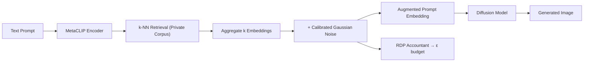

# PrivGen — Differentially Private Image Generation

<p align="center">
  
  
  
  
</p>

> **Generate high-quality images with provable privacy guarantees.** PrivGen augments text-to-image diffusion models with differentially private retrieval — pulling from private datasets without fine-tuning, preventing memorization of training samples while maintaining FID quality on MS-COCO and ImageNet.

---

## Table of Contents

- [The Problem](#the-problem)
- [The Solution](#the-solution)
- [Key Features](#key-features)
- [How It Works](#how-it-works)
- [Privacy Pipeline](#privacy-pipeline)
- [Architecture](#architecture)
- [Quickstart](#quickstart)
- [Privacy Analysis](#privacy-analysis)
- [Training Pipeline](#training-pipeline)
- [Key Components](#key-components)
- [Results](#results)
- [Project Structure](#project-structure)
- [License](#license)
- [Author & Contact](#-author--contact)

---

## The Problem

Text-to-image diffusion models memorize training data. Given the right prompt, they reproduce near-exact copies of images they were trained on — a critical privacy violation when training on sensitive or proprietary datasets:

| Risk | Impact |
|---|---|
| **Sample-level memorization** | Model outputs private training images verbatim |
| **Membership inference** | Attackers determine if a specific image was in training data |
| **No privacy guarantees** | Standard RAG augmentation provides zero formal privacy |
| **Fine-tuning requirement** | Adapting to private domains typically requires retraining on private data |
| **Quality degradation** | Naive noise addition destroys image generation quality |

PrivGen provides the first **differentially private retrieval-augmented diffusion** algorithm with provable privacy and competitive image quality.

---

## The Solution

PrivGen augments a pre-trained text-to-image diffusion model with a **differentially private retrieval mechanism**. Retrieved private samples are aggregated with calibrated Gaussian noise before being injected into the generation pipeline — providing formal (ε, δ)-differential privacy guarantees without any fine-tuning on private data.



---

## Key Features

### Differentially Private Retrieval
- k-nearest neighbor retrieval over MetaCLIP embeddings of a private corpus
- Mean aggregation of k retrieved embeddings with **calibrated Gaussian noise**
- Global sensitivity analysis ensures noise magnitude matches privacy requirements

### No Fine-Tuning Required
- Uses a pre-trained diffusion model trained on **public data only**
- Private domain adaptation happens entirely through retrieval augmentation at inference time
- Switch private retrieval corpora without retraining

### Memorization Prevention
- Noise perturbation prevents the model from reproducing exact private training samples
- Formal (ε, δ)-differential privacy guarantee bounds information leakage per query
- Privacy budget accumulates across queries with RDP accounting

### Privacy Budget Tracking
- **Rényi Differential Privacy (RDP) accountant** tracks cumulative privacy loss
- Configurable ε (privacy budget) and δ (failure probability)
- `calc_eps` function computes optimal noise multiplier for target privacy level

### Faiss-Accelerated Indexing
- Pre-computed MetaCLIP embeddings indexed with Faiss for fast k-NN search
- Supports large private corpora (ImageNet-scale) with sub-second retrieval
- WebDataset pipeline for efficient embedding generation at scale

---

## How It Works

### Step 1 — Encode the Prompt

The input text prompt is encoded into a MetaCLIP embedding vector — the same space as the private retrieval corpus.

### Step 2 — Private k-NN Retrieval

The query embedding retrieves the k nearest neighbors from the private Faiss index. These represent the most semantically similar private samples.

### Step 3 — DP Aggregation

The k retrieved embeddings are averaged (aggregated), then perturbed with Gaussian noise scaled to the global sensitivity and target privacy budget. This is the core privacy mechanism.

### Step 4 — Augmented Generation

The noisy aggregated embedding augments the original prompt embedding and is fed to the diffusion model, which generates an image influenced by the private domain without exposing individual samples.

### Step 5 — Privacy Accounting

The RDP accountant records the privacy cost of each query. Once the cumulative ε exceeds the budget, generation stops or noise increases.

---

## Privacy Pipeline

```
Text Prompt
    │
    ├─> MetaCLIP Encoder ────────── text → 512-dim embedding
    │
    ├─> Faiss k-NN Index ─────────── retrieve k nearest private embeddings
    │
    ├─> Aggregate & Noise ───────── mean(k embeddings) + N(0, σ²I)
    │       ├─> Training:   aggregate_and_noise()
    │       └─> Inference:  aggregate_and_noise_query()
    │
    ├─> Prompt Augmenter ────────── inject noisy retrieval into generation
    │
    ├─> Diffusion Model ─────────── text-to-image synthesis (RDM backbone)
    │
    └─> RDP Accountant ──────────── track cumulative ε per query batch
            └─> calc_eps(σ, q, k, T, δ) → (ε, α)
```

---

## Architecture

| Component | Module | Role |
|---|---|---|
| Text Encoder | MetaCLIP b16_400m | Prompt → embedding space |
| Retrieval Index | Faiss (IVF/HNSW) | Fast k-NN over private corpus |
| DP Mechanism | `aggregate_and_noise` | Mean aggregation + Gaussian perturbation |
| Diffusion Model | Retrieval-Augmented DM | Conditional image generation |
| Privacy Accountant | `calc_eps` (RDP) | ε budget computation and tracking |
| Embedding Pipeline | `wds_to_clip.py` | Batch embedding generation |
| Index Builder | `wds_build_faiss.py` | Faiss index construction |

---

## Quickstart

### Prerequisites

- Conda package manager
- CUDA-capable GPU (recommended)
- ~20 GB disk space for model weights

### Environment Setup

```bash
git clone <repository-url> privgen
cd privgen

conda env create --file environment.yml
conda activate dp_rdm

pip install albumentations opencv-python-headless
pip install torch==1.13.1 torchvision==0.14.1
```

### Download Models

```bash
# First-stage diffusion models
bash scripts/download_first_stages.sh

# MetaCLIP text encoder
wget https://dl.fbaipublicfiles.com/MMPT/metaclip/b16_400m.pt \
  -O models/metaclip/b16_400m.pt
```

---

## Privacy Analysis

Compute the privacy budget for your configuration:

```python
from experiments_utils import calc_eps

epsilon, alpha = calc_eps(
    noise_multiplier=1.0,    # Gaussian noise scale
    subsample_rate=0.01,     # Fraction of corpus sampled per query
    k_nn=5,                  # Number of neighbors aggregated
    num_queries=10000,       # Total generation queries
    delta=1e-5               # Privacy failure probability
)

print(f"Privacy budget ε = {epsilon:.2f} at order α = {alpha}")
```

See `privacy_analysis.ipynb` for interactive exploration of ε across:
- Dataset size (1K → 1M private samples)
- Noise magnitude (0.5 → 5.0)
- Number of neighbors k (1 → 50)
- Query count (100 → 100,000)

---

## Training Pipeline

### 1. Build Private Retrieval Index

```bash
# Generate MetaCLIP embeddings for private corpus
python wds_to_clip.py --config configs/dataset_builder/imagenet_fb.yaml

# Build Faiss index
python wds_build_faiss.py --input embeddings/ --output index/
```

### 2. Precompute Nearest Neighbors

```bash
python scripts/search_neighbors.py \
  --rconfig configs/dataset_builder/imagenet_fb.yaml \
  --qc configs/query_datasets/imagenet_fb.yaml \
  -s train -n
```

### 3. Train with DP Retrieval Augmentation

```bash
./train_private_rdm.sh
```

### 4. Generate Private Samples

See `sample_generation.ipynb` for end-to-end generation with live privacy budget tracking.

---

## Key Components

| Function / Script | When Used | Purpose |
|---|---|---|
| `aggregate_and_noise` | Training | Perturb batch embeddings with calibrated noise |
| `aggregate_and_noise_query` | Inference | DP retrieval augmentation at generation time |
| `calc_eps` | Analysis | Compute ε from noise, subsample rate, k, queries |
| `search_neighbors.py` | Preprocessing | Precompute k-NN for training query sets |
| `wds_to_clip.py` | Indexing | Generate MetaCLIP embeddings from WebDataset |
| `wds_build_faiss.py` | Indexing | Build Faiss index from embeddings |
| `train_private_rdm.sh` | Training | Full DP-RDM training pipeline |
| `privacy_analysis.ipynb` | Analysis | Interactive ε sensitivity analysis |

---

## Results

Evaluated on **MS-COCO** with privacy budget **ε = 10**:

| Method | FID ↓ | Privacy Guarantee | Fine-tuning Required |
|---|---|---|---|
| Public-only retrieval | Baseline + 3.5 | None | No |
| Standard RAG augmentation | Baseline | None | No |
| **PrivGen (ε = 10)** | **Baseline** | **(10, 10⁻⁵)-DP** | **No** |

Key findings:
- **3.5 FID improvement** over public-only retrieval at ε = 10 (up to 10,000 queries)
- Provable privacy without sacrificing generation quality
- Domain adaptation via retrieval swap — no retraining on private data
- Scales to ImageNet-scale private corpora with Faiss indexing

---

## Project Structure

```
privgen/
├── rdm/                         # Core diffusion model (RDM extension)
│   ├── util.py                  # aggregate_and_noise functions
│   └── data/                    # Dataset loaders (ImageNet face-blurred)
├── scripts/
│   ├── search_neighbors.py      # k-NN precomputation
│   └── download_first_stages.sh
├── configs/
│   ├── dataset_builder/         # Retrieval corpus configs
│   └── query_datasets/          # Query set configs
├── experiments_utils.py       # calc_eps privacy accountant
├── train_private_rdm.sh         # Training entry point
├── privacy_analysis.ipynb       # Interactive ε analysis
├── sample_generation.ipynb      # End-to-end generation demo
├── wds_to_clip.py               # Embedding generation
└── wds_build_faiss.py           # Faiss index builder
```

---

## License

CC-BY-NC — majority of PrivGen. Portions derived from [Retrieval-Augmented Diffusion Models](https://github.com/CompVis/retrieval-augmented-diffusion-models) under separate license terms.

---

## 👤 Author & Contact

- **Author**: Nathaniel Gordon
- **Role**: Senior AI & Machine Learning Engineer
- **GitHub**: [github.com/nathaniel-gordon](https://github.com/nathaniel-gordon)
- **Portfolio / Upwork**: [upwork.com/freelancers/~015fe5a704f8943797](https://www.upwork.com/freelancers/~015fe5a704f8943797)
- **Email**: nathanielgordon346@gmail.com
- **Location**: Tallahassee, FL, USA
